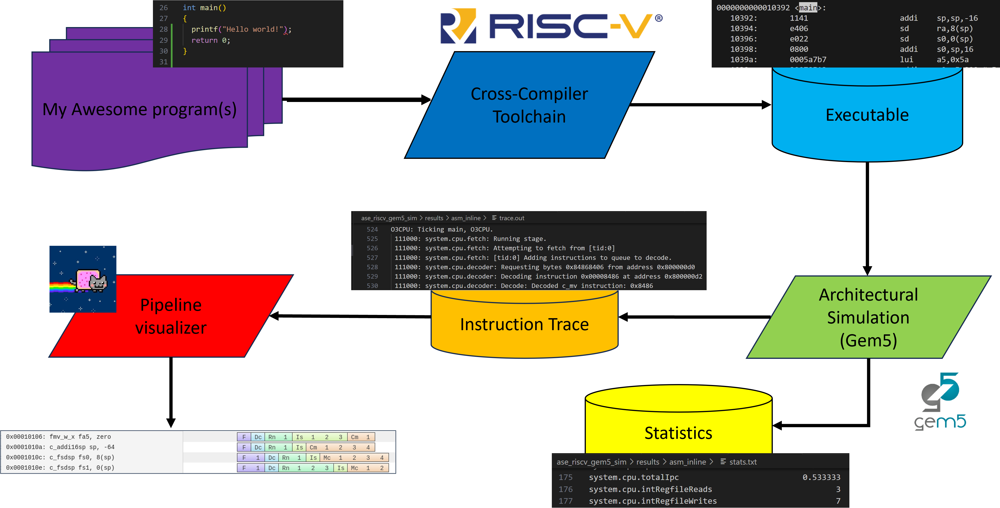
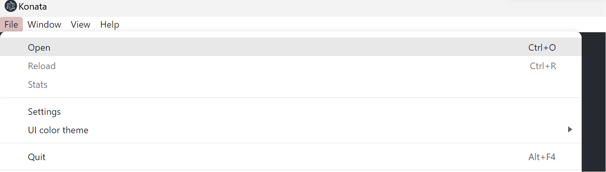

# Architetture dei Sistemi di Elaborazione@Politecnico di Torino: SIMULATING AN OoO RISC-V CPU WITH GEM5

This README provides an environment for simulating a program on a parametrizable RISC-V Out of Order (OoO) CPU and visualize the pipeline. You can see the flow in the Figure below.




## Table of contest
- [Architetture dei Sistemi di Elaborazione@Politecnico di Torino: SIMULATING AN OoO RISC-V CPU WITH GEM5](#architetture-dei-sistemi-di-elaborazionepolitecnico-di-torino-simulating-an-ooo-risc-v-cpu-with-gem5)
  - [Table of contest](#table-of-contest)
  - [Setup the environment](#setup-the-environment)
    - [Prerequisites](#prerequisites)
    - [Installing a Risc-V toolchain, the cross-compiler](#installing-a-risc-v-toolchain-the-cross-compiler)
    - [Installing Gem5, the Architectural Simulator](#installing-gem5-the-architectural-simulator)
    - [Installing Konata, the Pipeline Visualizer](#installing-konata-the-pipeline-visualizer)
  - [HOWTO - Simulate a Program](#howto---simulate-a-program)
  - [HOWTO - Visualize the Pipeline with Konata](#howto---visualize-the-pipeline-with-konata)
  - [Contributors](#contributors)

## Setup the environment 
First of all, you need to clone the repository with the following command, for SSH:
```
git clone git@github.com:cad-polito-it/ase_riscv_gem5_sim.git
```
For HTTPS:
```
git clone https://github.com/cad-polito-it/ase_riscv_gem5_sim.git
```

### Prerequisites
In order to simulate a benchmark, you need the following three tools:
- A Risc-V cross compiler
- An architectural simulator
- A pipeline visualizer

Installation guidelines are provided for each of the aforementioned tools.
In case you are using LABINF PCs, you can skip the installation part (Be aware, tools' compilation is time consuming!).

An important file for the simulation flow is the [```setup_default```](./setup_default).
In this file you need to specify you installation paths for different tools.
For example:
```
export CC="/usr/bin/riscv64-linux-gnu-gcc-10"
export GEM5_INSTALLATION_PATH="/mnt/d/gem5_simulator/build/"
export GEM5_SRC="/mnt/d/gem5_simulator/gem5/"
```
The ```CC``` is the cross compiler, and it is installed in ```/usr/bin```. Meanwhile the Architectural Simulator (Gem5) is installed in ```/mnt/d/gem5_simulator/build```, while its soruce are at ```/mnt/d/gem5_simulator/gem5```.

### Installing a Risc-V toolchain, the cross-compiler
 
You can compile from scratch the toolchain for Risc-V following the instruction @ https://github.com/riscv-collab/riscv-gnu-toolchain

For linux users, you can intall the toolchain using you package manager. For example, for ubuntu users:
```
sudo apt install gcc-riscv64-linux-gnu
```

### Installing Gem5, the Architectural Simulator
To install Gem5, you can follow the guidelines @ https://www.gem5.org/documentation/general_docs/building

Just remember that you need the following Gem5 characteristics to install:
- ISA = RISCV.
- variant = opt.

**Be aware:** the Gem5 compilation is very, very, very (did i already say very?!) time consuming.

You need to install a specific version of gem5:
```bash
git clone https://github.com/gem5/gem5.git && cd gem5
git checkout v22.1.0.0
```

### Installing Konata, the Pipeline Visualizer
To download Konata, visit the Konata github pages @ https://github.com/shioyadan/Konata/releases

Download the appropriate Konata release for your operating system. Konata is available for various platforms, including Windows, macOS, and Linux.

Unzip the release, inside you will find an executable named ```konata``` or ```konata.exe``` (**OS dependent!**).

**Be aware**: For windows/macOS users, you need to open the Konata application manually and load the trace

## HOWTO - Simulate a Program

To simulate a program, run the `simulate.sh` script with the desired program as an argument:  
```bash
./simulate.sh -i ./programs/sanity_test/ -nogui
```

You can specify with `-gui `or `-nogui `the automatic opening of the Konata simulation (**for linux users**).

This will produce an ELF (Executable and Linkable Format) file in the `programs/sanity_test/` directory.
Afterward, the ELF is passed to the Architectural Simulator, and program-related statistics (```stats.txt```) and trace (```trace.out```)are dumped in ```./results/sanity_test/```

## HOWTO - Visualize the Pipeline with Konata
The instruction trace, and the statistics are extractred **only** from a Region of Interest (ROI), as Figure below shows.

```C
#ifdef _GEM5_
#include <gem5/m5ops.h>
#endif /*_GEM5_*/

int main() {


/********************************************************
 *****      Starting Region of Interest (ROI)    ********
********************************************************/
#if _GEM5_
 m5_work_begin(1,1);   
#endif /*_GEM5_*/

    // my c benchmark core 
    angle2time_conversion();
    tooth_to_spark();

/********************************************************
 *****      End Region of Interest (ROI)         ********
********************************************************/
#ifdef _GEM5_
    m5_work_end(1,1);
#endif /*_GEM5_*/
    return 0;
}
```


To visualize the pipeline, follow these steps:

1. Load the `trace.out` file onto Konata, a tool for visualizing gem5 traces.
   From the menu in the window or using drag and drop.
    

2. Use Konata's interface to visualize and analyze the pipeline behavior of your simulated program.

**Note** For linux-based users you can directly launch the pipeline visualizer with the option ```-gui``` option in simulate script

## Contributors
- Francesco Angione (francesco.angione@polito.it)
- Giorgio Insinga (giorgio.insinga@polito.it)
- Annachiara Ruospo (annachiara.ruospo@polito.it)


