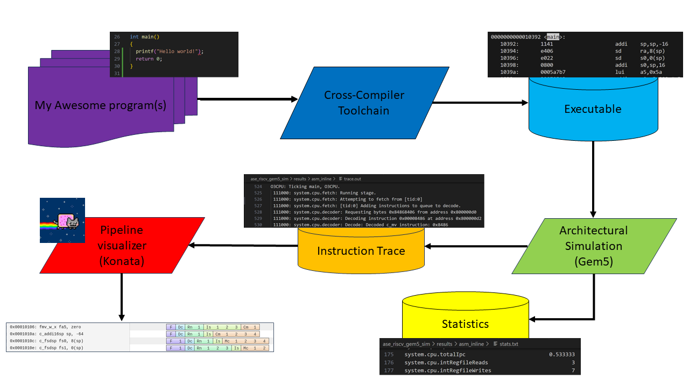

# Architetture dei Sistemi di Elaborazione@Politecnico di Torino: SIMULATING A RISC-V CPU WITH GEM5

This README provides an environment for simulating a program on a parametrizable RISC-V CPU and visualize the pipeline. You can see the flow in the Figure below.




## Table of contest
- [Architetture dei Sistemi di Elaborazione@Politecnico di Torino: SIMULATING A RISC-V CPU WITH GEM5](#architetture-dei-sistemi-di-elaborazionepolitecnico-di-torino-simulating-a-risc-v-cpu-with-gem5)
  - [Table of contest](#table-of-contest)
  - [Setup the environment](#setup-the-environment)
    - [Prerequisites](#prerequisites)
    - [Installing a Risc-V toolchain, the cross-compiler](#installing-a-risc-v-toolchain-the-cross-compiler)
    - [Installing Gem5, the Architectural Simulator](#installing-gem5-the-architectural-simulator)
    - [Installing Konata, the Pipeline Visualizer](#installing-konata-the-pipeline-visualizer)
  - [HOWTO - Simulate a Program](#howto---simulate-a-program)
  - [HOWTO - Visualize the Pipeline with Konata](#howto---visualize-the-pipeline-with-konata)
  - [Contributors](#contributors)

## Setup the environment 
First of all, you need to clone the repository with the following command, for SSH:
```
$ git clone git@github.com:cad-polito-it/ase_riscv_gem5_sim.git
```
For HTTPS:
```
$ git clone https://github.com/cad-polito-it/ase_riscv_gem5_sim.git
```

### Prerequisites
In order to simulate a program, you need the following three tools:
- A Risc-V cross compiler
- An architectural simulator
- A pipeline visualizer

Installation guidelines are provided for each of the aforementioned tools.
In case you are using LABINF PCs, you can skip the installation part.

An important file for the simulation flow is the [```setup_default```](./setup_default).
In this file you need to specify you installation paths for different tools.
For example:
```
export CC="/usr/bin/riscv64-linux-gnu-gcc-10"
export GEM5_INSTALLATION_PATH="/mnt/d/gem5_simulator/build/"
export GEM5_SRC="/mnt/d/gem5_simulator/gem5/"
```
The ```CC``` is the cross compiler, and it is installed in ```/usr/bin```. Meanwhile the Architectural Simulator (Gem5) is installed in ```/mnt/d/gem5_simulator/build```, while its soruce are at ```/mnt/d/gem5_simulator/gem5```.

In the repository, you have different ```setup_default``` files, each one for a specific configuration (LABINF, VM, or your native installation). You can choose the one that fits your needs. For example, if you want to use the LABINF configuration, you can copy the corresponding file ```setup_default_labinf``` to ```setup_default```:
```bash 
$ cp setup_default.labinf setup_default
```

### Installation 

In the repository, you can find a script named [```installation.sh```](./utils/installation.sh) (in the utils folder) that can help you to download the cross-compiler, the gem5 simulator and generate the ```setup_default``` file. You can run it with the following command:

```bash
$ ./utils/installation.sh
```
It will install the cross-compiler, gem5 and the pipeline visualizer in a default folder  named ```./tools/```. 

**It automatically updates the ```setup_default``` file with the correct paths.**

Check the following installation guidelines for each tool for the necessary dependencies and requirements before running the ```installation.sh``` script.
#### Installing a Risc-V toolchain, the cross-compiler

You can compile from scratch the toolchain and the necessary dependencies for Risc-V following [these instructions](https://github.com/riscv-collab/riscv-gnu-toolchain).


#### Installing Gem5, the Architectural Simulator

Start by cloning gem5 from this repository:
```
$ git clone https://github.com/cad-polito-it/gem5
```

To install Gem5 and the necessary dependencies, you can follow the README of that repo as well as these [instructions](https://www.gem5.org/documentation/general_docs/building).

Just remember that you need the following Gem5 characteristics to install:
- ISA = RISCV.
- variant = opt.

#### Installing the Gem5 Pipeline Visualizer
$\color{Red}\Huge{\textsf{This section is for the In order Architecture}}$

To install the Gem5 Pipeline Visualizer, you can follow these [instructions](https://github.com/cad-polito-it/gem5_visualizer).

You need to install Qt 6.8.3 (**VERY IMPORTANT**) from [here](https://www.qt.io/download-qt-installer). 
You can follow [these instructions](https://doc.qt.io/qt-6/gettingstarted.html) for the installation.

Make sure to install the desktop version and the needed libraries, as well cmake as shown in the following:


After installing Qt, you need to set the ```QT_INSTALLATION_DIR``` environment variable to point to the Qt installation directory. By default should be like the following:
```bash
export QT_INSTALLATION_DIR="/opt/Qt/6.8.3/gcc_64"
```

Then, you can run the ```installation.sh``` script that will download and compile the Gem5 Pipeline Visualizer.

## HOWTO - Simulate a Program

To simulate a program, run the `simulate.sh` script with the desired program as an argument, and the desired configuration file:  
```bash
./simulate.sh -i ./programs/sanity_test/ -nogui --setup ./setup_default
```

You can specify with `-gui `or `-nogui `the automatic opening of the Pipeline visualizer.

This will produce an ELF (Executable and Linkable Format) file in the `programs/sanity_test/` directory.
Afterward, the ELF is passed to the Architectural Simulator, and program-related statistics (```stats.txt```) and trace (```trace.out```)are dumped in ```./results/sanity_test/```

You can execute the script in interactive mode:
```bash
./simulate.sh -setup ./setup_default
```

## HOWTO - Add a new program
For adding a new program, you can follow the steps below:
1. Copy an existing folder in the `programs/` directory, e.g., `programs/program_1/` and rename it to `programs/program_2/`.
2. Modify the source code (assembly or c files) in the `program_2/` folder.
3. Modify the `Makefile` in the `program_2/` folder if necessary (add new source files). In the following line (line 23):
    ```makefile
    ASM = ./program2.s # Removed ./program1.s
    ```

## Contributors
- Francesco Angione (francesco.angione@polito.it)
- Nicola di Gruttola giardino (nicola.digruttola@polito.it)
- Behnam Farnaghinejad (behnam.farnaghinejad@polito.it)
- Gabriele Filipponi (gabriele.filipponi@polito.it)
- Giorgio Insinga (giorgio.insinga@polito.it)
- Annachiara Ruospo (annachiara.ruospo@polito.it)
- Antonio Porsia (antonio.porsia@polito.it)

Feel free to contribute with issues and pull requests or contact us!
